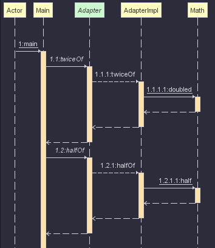

#### 어댑터 패턴

- 연관성 없는 두 객체 묶어 사용하기

#### 요구사항
- 두 수에 대한 다음 연산을 수행하는 객체를 만들어 주세요
    - 수의 두 배의 수를 반환 :twiceOf(Float): Float
    - 수의 반(1/2)의 수를 반환 : halfOf(Float): Float
- 구현 객체 이름은 Adapter 로 해주세요
- Math 클래스에서 두 배와 절반을 구하는 함수는 `이미 구현`되어있습니다

```java
public class Math {

    // 두배
    public static double twoTime(double num) { return num * 2; }

    // 절반
    public static double half(double num) { return num / 2; }

    // 강화된 알고리즘
    public static Double doubled(Double d) { return d*2; }
}
```

#### 추가 요구 사항
- 알고리즘 변경을 원합니다
    - Math 클래스에 새롭게 두배를 구할 수 이는 함수가 추가 되었습니다.
    - 새로 구현된 알고리즘을 이용하도록 프로그램을 수정해 주세요
    
- 절반을 구하는 기능에서 `로그를 찍는 기능을 추가`해 주시기 바랍니다


#### 결론
- 주어진 Math 클래스를 묶어서 사용 할 수 있다
- 원하는 기능을 Adapter 라는 인터페이스에 선언 하고,<br>
주어진 기능을 AdapterImpl 에서 묶어서 사용할 수 있다
