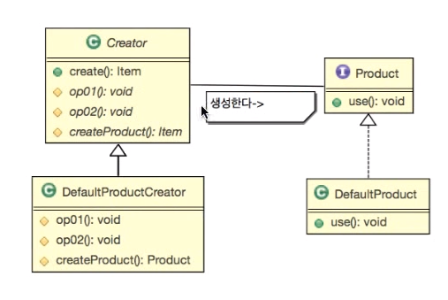

# 팩토리 메소드 패턴

#### 요구사항
- 게임 아이템과 아이템 생성을 구현해주세요
    - 아이템을 생성하기 전에 데이터 베이스에서 아이템 정보를 요청합니다.
    - 아이템을 생성 후 아이템 복제 등의 불법을 방지하기 위해 데이터 베이스에 아이템 생성 정보를 남깁니다.
- 아이템을 생성하는 주제를 ItemCreator 로 이름 짓습니다.
- 아이템은 item 이라는 interface 로 다룰 수 있습니다.
    - item 은 use 함수를 기본 함수로 갖고 있습니다.
- 현재 아이템의 종류는 체력 회복 물약, 마력 회복 물약이 있습니다.

