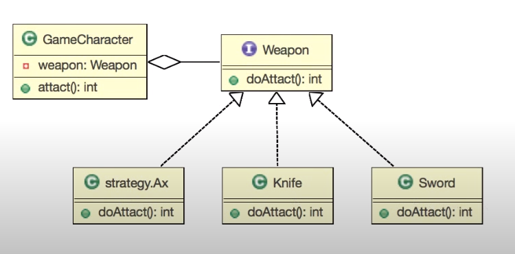

## 전략 패턴

- 여러 알고리즘을 하나의 `추상적인 접근점`을 만들어 접근 점에서  
서로 `교환 가능`하도록 하는 패턴.
    - 추상적인 접근은 `인터페이스`를 생각 하면 된다.
    
#### 요구사항
- 신작 게임에서 케릭터와 무기를 구현해 보세요
- 무기는 두가지 종류가 있습니다
    - 칼
    - 검

- 추가 요구 사항
    - 도끼를 추가해 주세요
   

### 결론
- 추상적인 접근 점인 Weapon 이라는 인터페이를 만들고, 케릭터는 인터페이스에 
접근하여 공격을 하게 된다.
- Weapon 이라는 인터페이스는 각 무기들이 구현되고 게임 케릭터는 구현체를 
바꾸어 가면서 각 구현체를 접근하여 사용 할 수 있다.

